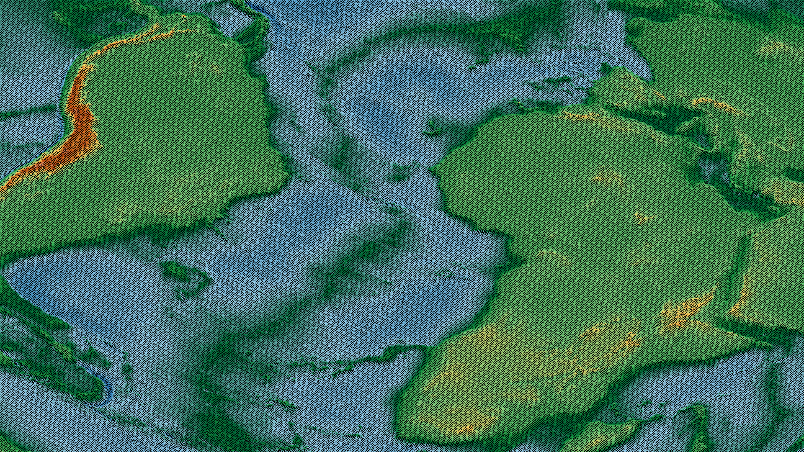

# FDF - Wireframe 3D Renderer (SDL2 Edition)


<p align="center">
  
</p>

## 📋 Table of Contents
- [About](#about)
- [From MiniLibX to SDL2](#from-minilibx-to-sdl2)
- [Features](#features)
- [Requirements](#requirements)
- [Installation](#installation)
- [Usage](#usage)
- [Controls](#controls)
- [Map Format](#map-format)
- [Project Structure](#project-structure)
- [Technical Notes](#technical-notes)
- [Known Issues](#known-issues)
- [License](#license)

<a name="about"></a>
## 🎯 About

**FDF** (Fil de Fer, French for "wireframe") is a 3D wireframe viewer that renders elevation maps as interactive 3D landscapes. This project creates a graphical representation by connecting 3D points (x, y, z) with line segments to form a mesh.

Originally developed as a 42 school project using **MiniLibX** (macOS version) and successfully earning a grade of **125%** (mandatory + bonus), this version has been **migrated to SDL2** for better cross-platform compatibility and enhanced graphics capabilities.

**Original project**: [42cursus_fdf](https://github.com/jesuserr/42cursus_fdf)

<a name="from-minilibx-to-sdl2"></a>
## 🔄 From MiniLibX to SDL2 

### Why SDL2?

After project approval, the graphics library was replaced with **SDL2** to provide:

- **Cross-platform compatibility**: Works on Linux, macOS, and Windows
- **Better performance**: Hardware-accelerated rendering
- **Active maintenance**: SDL2 is actively developed and widely supported
- **Modern API**: More flexible and feature-rich graphics capabilities
- **Learning opportunity**: Experimentation with different graphical libraries beyond the 42 curriculum

### Migration Details

The core FDF logic remains intact, with changes focused on the rendering layer:

| MiniLibX | SDL2 |
|----------|------|
| `mlx_init()` | `SDL_Init()` |
| `mlx_new_window()` | `SDL_CreateWindow()` |
| `mlx_new_image()` | `SDL_CreateRenderer()` |
| `mlx_get_data_addr()` | `SDL_CreateTexture()` (direct texture access) |
| `mlx_put_image_to_window()` | `SDL_RenderCopy()` + `SDL_RenderPresent()` |
| `mlx_string_put()` | `stringColor()` (SDL2_gfx) |
| Keyboard/mouse hooks | `SDL_Event` polling (keyboard + mouse) |

<a name="features"></a>
## ✨ Features

### Visualization Modes
- **Isometric projection** (default view)
- **Parallel/Orthographic projection**
- **Perspective projection**

### Interactive Controls
- **3D Rotation**: Rotate on X, Y, and Z axes with keyboard controls
- **Translation**: Move the model using arrow keys
- **Zoom**: Adjust viewing distance (keyboard and mouse wheel)
- **Height scaling**: Adjust Z-axis elevation
- **Smooth animation**: Automatic rotation mode
- **Quick reset**: Restore default view with mouse wheel click

### Visual Features
- **Color support**: Read colors from map files (hexadecimal format)
- **Multiple projections**: Switch between different viewing perspectives
- **Real-time rendering**: All transformations update instantly
- **FPS display**: Toggle frame rate counter for performance monitoring
- **Angle display**: Toggle rotation angle values overlay (X, Y, Z axes)
- **Screenshot capture**: Save the current render to PNG format with F12

### Technical Features
- **Optimized rendering**: Direct texture memory access instead of individual pixel API calls for dramatic performance improvement  
- **Hardware acceleration**: SDL2 texture-based rendering with single GPU transfer per frame
- **Efficient algorithms**: Bresenham line drawing with direct pixel buffer manipulation
- **Fast map loading**: Uses `mmap()` instead of `get_next_line()` for dramatically improved file reading performance
- **Large map support**: Can handle maps with thousands of points
- **Memory management**: Clean allocation/deallocation with no leaks (except SDL2 library internal leaks)
- **Error handling**: Robust validation for file format and content

<a name="requirements"></a>
## 🔧 Requirements

### System Dependencies
```bash
# Ubuntu/Debian
sudo apt-get update
sudo apt-get install libsdl2-dev libsdl2-gfx-dev libsdl2-image-dev

# macOS (with Homebrew)
brew install sdl2 sdl2_gfx sdl2_image
```

### Build Tools
- GCC or Clang compiler
- Make
- Standard C library (C99 or later)

<a name="installation"></a>
## 🚀 Installation

1. **Clone the repository**
```bash
git clone https://github.com/jesuserr/42Cursus_fdf_SDL2.git
cd 42Cursus_fdf_SDL2
```

2. **Compile the project**
```bash
make
```

This will:
- Compile the custom `libft` library
- Compile all FDF source files
- Link with SDL2, SDL2_gfx, and SDL2_image libraries
- Create the `fdf` executable

3. **Clean build files** (optional)
```bash
make clean   # Remove object files
make fclean  # Remove object files and executable
make re      # Recompile everything
```

<a name="usage"></a>
## 🎮 Usage

```bash
./fdf <map_file.fdf>
```

### Examples
```bash
# Simple 42 logo
./fdf maps/42.fdf

# Colored terrain
./fdf maps/t1.fdf

# Mandelbrot fractal (250000 points)
# Recommended to toggle to wireframe mode (R key) for better performance
./fdf maps/elem-fract.fdf

# Extra large maps (723200 points)
# Recommended to toggle to wireframe mode (R key) for better performance
./fdf maps/extra/MGDS_WHOLE_WORLD_OCEAN1_XL.fdf
```

<a name="controls"></a>
## 🎨 Controls

> **💡 Tip**: Press **F1** during execution to display an in-program help overlay with all available controls.

### Keyboard Controls

| Key | Action |
|-----|--------|
| **F1** | Toggle on-screen help display |
| **ESC** | Exit program |
| **SPACE** | Toggle automatic rotation animation |
| **C** | Reset view (zoom, position, rotation, and height) |
| **R** | Toggle line rendering (show/hide wireframe) |
| **G** | Toggle gradient color interpolation |
| **F** | Toggle FPS display (top-left corner) |
| **T** | Toggle angle display (X, Y, Z rotation values) |
| **F12** | Take a screenshot |
| **I** | Top view projection |
| **O** | Front view projection |
| **P** | Side view projection |

#### Rotation
| Key | Action |
|-----|--------|
| **Q** | Rotate down (X-axis -) |
| **W** | Rotate up (X-axis +) |
| **A** | Rotate left (Y-axis -) |
| **S** | Rotate right (Y-axis +) |
| **Z** | Rotate counterclockwise (Z-axis -) |
| **X** | Rotate clockwise (Z-axis +) |

#### Translation
| Key | Action |
|-----|--------|
| **Arrow Keys** | Move model (up/down/left/right) |

#### Zoom
| Key | Action |
|-----|--------|
| **E** | Zoom in |
| **D** | Zoom out |

#### Scaling
| Key | Action |
|-----|--------|
| **1** | Increase Z-axis height |
| **2** | Decrease Z-axis height |
| **V** | Reverse Z-axis (flip terrain upside down) |

#### Line Thickness
| Key | Action |
|-----|--------|
| **3** | Increase line/point thickness |
| **4** | Decrease line/point thickness |

### Mouse Controls

| Action | Effect |
|--------|--------|
| **Mouse wheel up** | Zoom in (same as E key) |
| **Mouse wheel down** | Zoom out (same as D key) |
| **Mouse wheel click** | Reset view (same as C key) |

<a name="map-format"></a>
## 📝 Map Format

FDF uses `.fdf` files with a simple text format:

### Basic Format
```
0 0 0 0 0
0 1 2 1 0
0 2 4 2 0
0 1 2 1 0
0 0 0 0 0
```

Each number represents the **Z-axis height** at that grid point.
- Rows: Y-axis coordinates
- Columns: X-axis coordinates
- Values: Z-axis elevation

### Color Format
Add hexadecimal colors after Z values:
```
0,0xFF0000 0,0x00FF00 0,0x0000FF
1,0xFFFF00 2,0xFF00FF 1,0x00FFFF
```

Format: `z_value,0xRRGGBB`

### Example Maps

The project includes various test maps in the `maps/` directory:
- **Simple shapes**: Basic geometric forms for testing
- **42 logos**: School logo with and without colors
- **Terrain data**: Real-world elevation maps
- **Extra maps**: Large-scale geographical data (in `maps/extra/`)

### Creating Custom Maps

1. Create a text file with `.fdf` extension
2. Use spaces to separate values on each line
3. Ensure all rows have the same number of elements
4. Z values can be positive, negative, or zero
5. Optional: Add colors in hexadecimal format

<a name="project-structure"></a>
## 📁 Project Structure

```
.
├── Makefile                 # Build configuration
├── README.md                # This file
├── srcs/                    # Source files
│   ├── fdf.h                   # Main header with structs and prototypes
│   ├── main.c                  # Entry point and initialization
│   ├── graphics.c              # SDL2 rendering functions
│   ├── effects.c               # HUD overlay (FPS, angles, help)
│   ├── screenshot.c            # Screenshot capture to PNG files
│   ├── hooks.c                 # Keyboard event handling
│   ├── mouse.c                 # Mouse event handling (wheel, clicks)
│   ├── projections.c           # Projection calculations
│   ├── rotations.c             # 3D rotation transformations
│   ├── moves.c                 # Movement and key actions
│   ├── map_utils.c             # Map parsing and validation
│   ├── z_utils.c               # Z-axis calculations and centering
│   └── errors.c                # Error handling
├── libft/                   # Custom C library
│   ├── printf/                 # ft_printf implementation
│   └── ...                     # Other utility functions
└── maps/                    # Sample map files
```


<a name="technical-notes"></a>
## 📚 Technical Notes

### Algorithm Highlights
- **Bresenham's Line Algorithm**: Efficient rasterization with integer arithmetic, optimized for direct pixel buffer access
- **3D Rotation Matrices**: Separate X, Y, Z axis rotations
- **Isometric Projection**: 45° rotation on Y-axis, 35° on X-axis
- **Automatic Scaling**: Adapts to different map sizes and window dimensions

### Hypsometric Color Palette
When map points have no explicit color, elevation is rendered using a **10-stop hypsometric tint gradient** inspired by the color conventions used in physical cartography. The palette covers the full elevation range including below-sea-level altitudes:

- **Stops 0–3**: Deep navy → ocean blue → mid blue → coastal blue (water / bathymetry)
- **Stops 4–6**: Dark green → forest green → light green (lowlands and plains)
- **Stops 7–8**: Amber yellow → terra cotta (hills and mountains)
- **Stop 9**: Near-white (snow-capped peaks)

### Code Standards
This SDL2 version maintains **full compliance with 42's Norminette** coding standard, which explains some unconventional coding patterns that may be encountered, such as:
- Function length limited to 25 lines and no more than 5 functions per file
- Maximum 4 parameters per function and no declaration and assignment in the same line
- All variables must be declared at the beginning of a function
- Strict formatting rules for brackets, spaces, and indentation

These constraints, while restrictive, demonstrate the ability to write clean, maintainable code within strict guidelines.

<a name="known-issues"></a>
## 🐛 Known Issues

- SDL2 internal allocations may show as "still reachable" in memory checkers (not project leaks)

<a name="license"></a>
## 📄 License

This project is part of 42 school curriculum. Feel free to use it for learning purposes.

---
